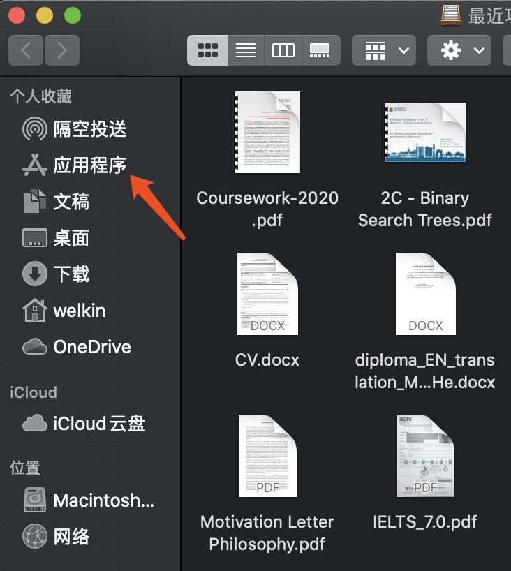
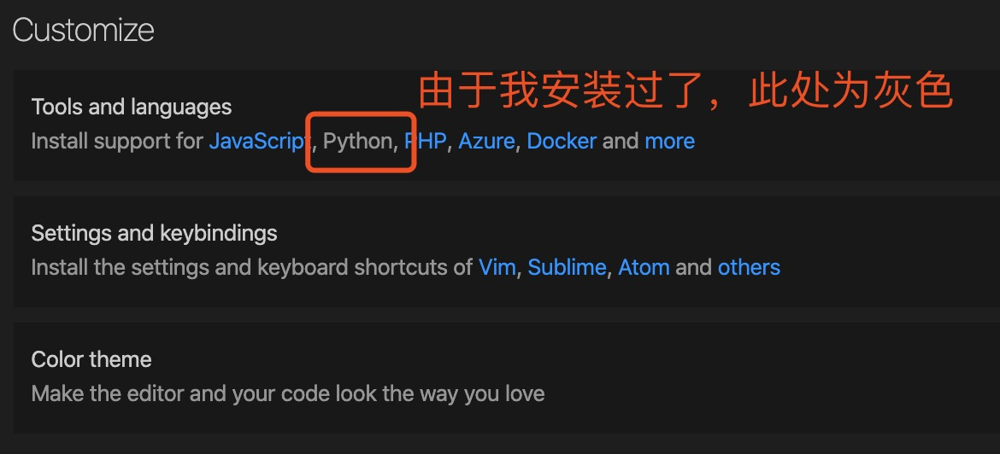
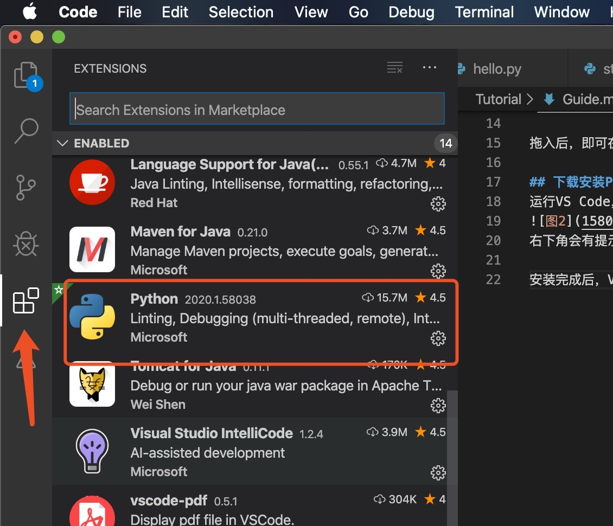
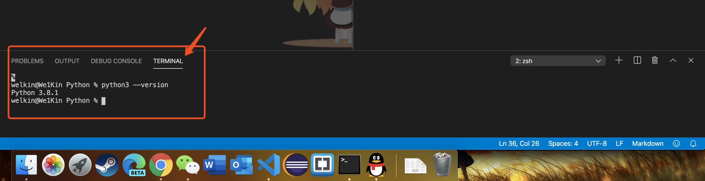
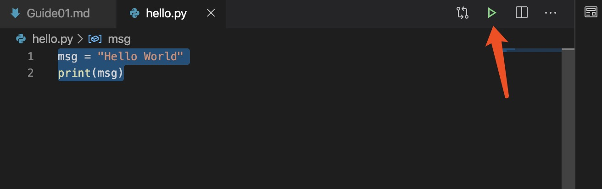
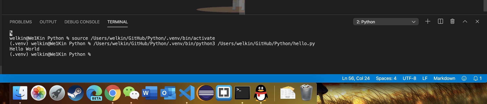

# 学习Python的第一天

任务:  
* 安装进行编写Python所需的软件和开发环境  
    1. 编写工具：Visual Studio Code  
    2. 开发环境：Python3 3.8.1 (Python.prg)    
* Hello Word首运行
* 包的导入和虚拟环境

## 下载安装Visual Studio Code  
进入[VS Code官网](https://code.visualstudio.com/)，点击“Downlaod for Mac(Stable Build)” 按钮下载。  

下载后得到zip压缩文件包，双击解压，得到VS Code.app。  

打开macOS中的 “访达” ，将VS Code.app拖入左侧列表的应用程序中。如

拖入后，即可在启动台中启动VS Code

## 在VS Code中安装Python扩展
运行VS Code，在欢迎界面中的Customize中，点击Python按钮.

右下角会有提示，程序将在安装完相应扩展后重启窗口，点击OK。开始安装。

安装完成后，VS Code会自动重新启动，在右侧的扩展会看到Python扩展已安装。


## 安装Python环境(Python解释器)
在[Python.org页面](https://www.python.org/downloads/)下载最新版本的Python3并安装。  

安装完成后，创建一个文件夹专门存放Python的程序，打开VS Code，依次通过File -> Open -> 打开刚才创建的文件夹。

随后，通过Terminal -> New Terminal在VS Code中打开命令行。

在命令行中，输入
```
python3 --version
```
来验证Python是否正确安装。正确安装后，会提示
```
Python 3.8.1
```

## 第一个Python程序
在VS Code打开的工作环境（文件夹）下，在文件目录下，右键 New File 创建一个名为hello.py的文件。  

注意: （在VS Code里面创建文件都需要手打后缀名。所以请完全打上名字 hello.py）

  

复制粘贴以下代码在[hello.py](../Code/01/hello.py)文件中
```python
msg = "Hello World"
print(msg)
```
保存，点击右上角的 运行 小按钮。

然后可以在下面的Terminal中查看运行结果  


## 虚拟环境的配置和第一次导入包
### 包的引入
在VS Code打开的工作环境（文件夹）下，在资源管理器的文件目录下，右键 New File 创建一个名为[standardplot.py](../Code/01/standardplot.py)的文件。 并粘贴如下代码
```python
import matplotlib.pyplot as plt
import numpy as np

x = np.linspace(0, 20, 100)  # Create a list of evenly-spaced numbers over the range
plt.plot(x, np.sin(x))       # Plot the sine of each x point
plt.show()                   # Display the plot
``` 
此时当您点击“运行”按钮后，您会得到“**ModuleNotFoundError: No module named 'matplotlib'**” 的错误提示。

### 虚拟环境
为了解决该问题，我们学习如何引入包，在引入包之前，要了解“虚拟环境”这个概念及其功能。(回忆我举得例子，整台电脑就是一个大房子，虚拟环境就是分房，不然就是同居)

给项目使用特定的虚拟环境(其中包含全局解释器的副本)。激活该环境后，您随后安装的所有软件包都将与其他环境隔离。这种隔离减少了因版本冲突而引起的许多复杂情况。要创建虚拟环境并安装所需的软件包，请根据您的操作系统输入以下命令：
```
python3 -m venv .venv
source .venv/bin/activate
```
### 导入软件包
创建好虚拟环境后，再导入包  
在终端输入下一命令来下载和导入Python包
```
python3 -m pip install matplotlib
国内使用
python3 -m pip install -i https://pypi.tuna.tsinghua.edu.cn/simple/ matplotlib
```

待包导入完毕后，运行程序，可得到如图所示的运行结果


<p align="center">
    <a href="Guide02.md">下一篇教程
</p>
