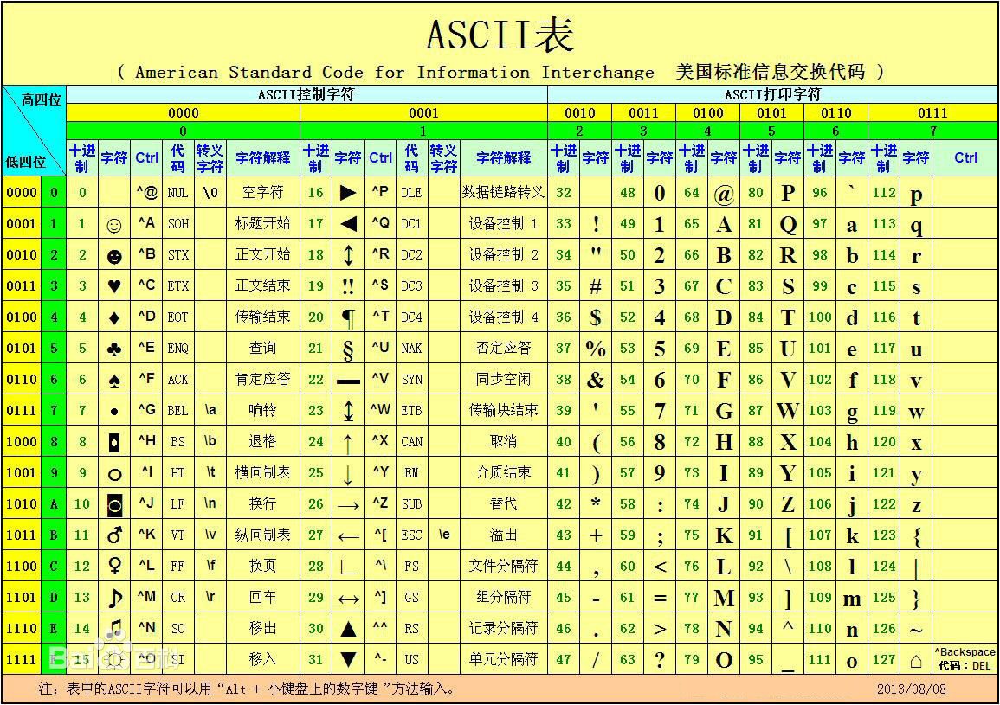

# 学习Python的第三天

任务:  
- 了解字符串处理和文本编码问题
    - 简单熟悉字符串规格化处理

第三天，我们坐下来聊一聊，在计算机里面，文本，字符这类玩意儿是怎么被计算机所处理的。

## 字符处理和ASCII

世界上各种各样的语言，光是录入计算机内能够被计算机所显示，识别的文字语言已经快接近现实世界的文字语言了。英语有英语的文字集（虽然它就26个字母），西米尔语有他妈的字符，中文有中文的字符集（中文字符基本上可以说是是世界上比较难处理的文字集合之一了）除此之外还有阿拉伯语（更为难处理，阿拉伯语的排版处理曾经是一大难题）。

而且，我们也知道计算机其实是只能理解1和0的，所以说，世界上所有的文字字符都是被转换成二进制的数字，存储并被计算机所理解。从一开始英文字符52个字母（大小写）和0-9十个数字字符加上其他控制字符，通信字符，转义字符和符号字符。一共127个字符被用八位二进制编码所表示出来。史称ASCII码（如图）


## Unicode的大一统
正如前文所说，ASCII只能提供英文字符等，对于世界上其他民族语言并不支持。旧的方法是每种民族文字字符有单独的字符集进行处理。但是如果机器缺少字符集，则会出现我们喜闻乐见的“乱码”现象。

于是乎一种新的字符文本编码机制诞生————Unicode。Unicode把所有语言都统一到一套编码里，这样就不会再有乱码问题了。

字母`A`用ASCII编码是十进制的`65`，二进制的`01000001`, 用Unicode编码是`00000000 01000001`。

字符`0`用ASCII编码是十进制的`48`，二进制的`00110000`，用Unicode编码是`00000000 00110000`，注意字符'0'和整数0是不同的；

汉字`中`已经超出了ASCII编码的范围，用Unicode编码是十进制的`20013`，二进制的`01001110 00101101`。

新的问题又出现了：如果统一成Unicode编码，乱码问题从此消失了。但是，如果你写的文本基本上全部是英文的话，用Unicode编码比ASCII编码需要多一倍的存储空间，在存储和传输上就十分不划算。

## UTF-8

本着节约的精神，又出现了把Unicode编码转化为“可变长编码”的UTF-8编码。UTF-8编码把一个Unicode字符根据不同的数字大小编码成1-6个字节，常用的英文字母被编码成1个字节，汉字通常是3个字节，只有很生僻的字符才会被编码成4-6个字节。如果你要传输的文本包含大量英文字符，用UTF-8编码就能节省空间：

| 字符 | ASCII | Unicode | UTF-8 |
| - | - | - | - | 
| A | 01000001 | 00000000 01000001 | 01000001 |
| 中 | 不存在 | 01001110 00101101 | 11100100 10111000 10101101
|

## 计算机中的文本处理规则

我们就可以总结一下现在计算机系统通用的字符编码工作方式：

在计算机内存中，统一使用Unicode编码，当需要保存到硬盘或者需要传输的时候，就转换为UTF-8编码。

用记事本编辑的时候，从文件读取的UTF-8字符被转换为Unicode字符到内存里，编辑完成后，保存的时候再把Unicode转换为UTF-8保存到文件。

浏览网页的时候，服务器会把动态生成的Unicode内容转换为UTF-8再传输到浏览器。

## Python的字符串和字符串在输出时的规格化

### 字符串的使用和表示
Python3中，所有的字符串都默认用unicode编码，那么从侧面说明Python的字符串能够处理多种语言。比如我们打印一个多语言字符串：
```python
>>> print('包含中文的str')
包含中文的str
```
对于单个字符的编码，Python提供了`ord()`函数获取字符的整数表示，`chr()`函数把编码转换为对应的字符：
```python
>>> ord('A')
65
>>> ord('中')
20013
>>> chr(66)
'B'
>>> chr(25991)
'文'
```
当然，如果我们知道文本字符的编码，还可以用十六进制来写字符串：
```python
>>> '\u4e2d\u6587'
'中文'
```
### 编码和解码
***字符串在计算机中的存储和网络中的传输***  

以上字符串，在计算机中都是其表现形式。而计算机中所有的数据都是存储在某块存储空间上的，或者，数据是通过网络在计算机与计算机进行传输的。

在此我们引入一个概念：**字节** 
> 计算机中存储数据的单元，一个8位的二进制数，是一个很具体的存储空间。

字符和字符串，都将被转换成字节被存储。那么像一个字符串变量，如何转换为字节呢？
这就涉及了一个过程：**编码** 
> 规定每个“字符”分别用一个字节还是多个字节存储，用哪些字节来存储，这个规定就叫做“编码”。

与之相反的，从字节解析为字符和字符串的过程，就是**解码**。

在Python中，从字符串`string`转换为字节`bytes`的编码过程有一个函数名为`encode()`，解码过程的函数名为`decode()`。

编码：
```python
>>> 'ABC'.encode('ascii')
b'ABC'
>>> '中文'.encode('utf-8')
b'\xe4\xb8\xad\xe6\x96\x87'
>>> '中文'.encode('ascii')
Traceback (most recent call last):
  File "<stdin>", line 1, in <module>
UnicodeEncodeError: 'ascii' codec can't encode characters in position 0-1: ordinal not in range(128)
```
纯英文的字符串可以用ASCII编码为bytes，内容是一样的，含有中文的字符串可以用UTF-8编码为bytes。含有中文的字符串无法用ASCII编码，因为中文编码的范围超过了ASCII编码的范围，Python会报错。

解码：
```python
>>> b'ABC'.decode('ascii')
'ABC'
>>> b'\xe4\xb8\xad\xe6\x96\x87'.decode('utf-8')
'中文'
```
如果bytes中包含无法解码的字节，decode()方法会报错：
```python
>>> b'\xe4\xb8\xad\xff'.decode('utf-8')
Traceback (most recent call last):
  ...
UnicodeDecodeError: 'utf-8' codec can't decode byte 0xff in position 3: invalid start byte
```

### 字符串的规格化处理
由于Python的底层是从C语言实现来的。所以在字符串的处理上，与C语言十分相似。
假如我们要输出一段这样的字符串`亲爱的xxx你好！你xx月的话费是xx，余额是xx`之类的字符串，而`xxx`的内容都是根据变量变化的，所以，需要一种简便的格式化字符串的方式。

#### 规格化方法一
我们使用一定的占位符，在一段字符串中，标记需要变化处理的部分的位置，然后将需要的字符串变量提供给这些被标记的位置，就可以实现上面问题的解决。

`%`运算符就是用来格式化字符串的。在字符串内部，`%s`表示用字符串替换，`%d`表示用整数替换，`%f`表示用浮点数替换，有几个`%?`占位符，后面就跟几个变量或者值，顺序要对应好。如果只有一个`%?`，括号可以省略。
> 在用`%f`处理浮点数的时候，可以用`%.2f`这样的占位符表示，保留小数点后两位小数。

> 在用占位符处理数字和文本时，可以设定一个输出的宽度为固定大小。比如我们输出数字，要求数字始终由三位数来表示。不足三位的要在前面补0。我们可以使用`%03d`来表示输出宽度为三位，不足前补0。这就是其中`03`各自的的含义
```python
>>> 'Hello, %s' % 'world'
'Hello, world'
>>> 'Hi, %s, you have $%d.' % ('Michael', 1000000)
'Hi, Michael, you have $1000000.'
```
如果你不太确定应该用什么，`%s`永远起作用，它会把任何数据类型转换为字符串：
```python
>>> 'Age: %s. Gender: %s' % (25, True)
'Age: 25. Gender: True'
```
有些时候，字符串里面的`%`是一个普通字符怎么办？这个时候就需要转义，用`%%`来表示一个`%`：
```python
>>> 'growth rate: %d %%' % 7
'growth rate: 7 %'
```

#### 规格化方法二
另一种格式化字符串的方法是使用字符串的`format()`方法，它会用传入的参数依次替换字符串内的占位符`{0}`、`{1}`……，不过这种方式写起来比`%`要麻烦得多：
```python
>>> 'Hello, {0}, 成绩提升了 {1:.1f}%'.format('小明', 17.125)
'Hello, 小明, 成绩提升了 17.1%'
```

<p align="center">
  <a href="Guide02.md">上一篇教程</a>  --------------------------------------  <a href="Guide04.md">下一篇教程
</p>