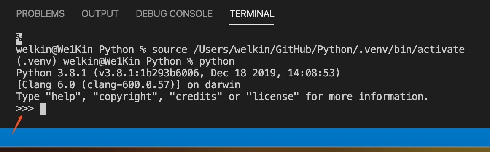

# 学习Python的第五天

任务:
- 复习前三天的所有内容
    - 将前三天的内容应用于编程中
- 学会使用操作符进行四则运算
- 学会使用操作符进行位运算（仅了解，不要求理解）
- 学会使用操作符进行不等比较
- 学会使用操作符进行操作并赋值
  - 理解赋值这个概念，而不是简单的理解为相等

## 运算符与表达式
你所编写的大多数 **语句(逻辑行)** 都包含了 **表达式（Expressions）**。一个表达式的简单例子便是 `2+3`。表达式可以拆分成运算符（Operators）与操作数（Operands）。
运算符（Operators）是进行某些操作，并且可以用诸如 `+` 等符号或特殊关键词加以表达的功能。运算符需要一些数据来进行操作，这些数据就被称作操作数（Operands）。在上面的例子中 `2` 和 `3` 就是操作数。

## 运算符
接下来我们将简要了解各类运算符及它们的用法。
要记得你可以随时在解释器中对给出的案例里的表达式进行求值。例如要想测试表达式 `2+3`，则可以使用**交互式 Python 解释器提示符**：
```python
>>> 2 + 3
5
>>> 3 * 5
15
```
### **交互式 Python 解释器提示符**
这是一个简单的不用创建文件就能执行一些简单程序指令的方式。

使用交互式Python解释器提示符的方法为：
1. 在VS Code中，新建终端(New Terminal 快捷键为control + shift + `（1旁边那个键）)
2. 在终端中输入python，得到下图：  

3. 当终端中出现`>>>`时，说明 交互式Python解释器提示符 已经开启。在`>>>`后面直接输入一些短小的指令，按下回车就可以执行。比如：  

> 现在可以回想一下，在前三天的教程中，也有很多地方应用到了这种方式。可以自己尝试一下那些示范性的小代码。

## 下面是可用运算符的速览：
- +（加）
  - 两个对象相加。
  - `3+5` 则输出 `8`。`'a' + 'b'` 则输出 `'ab'`。
- -（减）
  - 从一个数中减去另一个数，如果第一个操作数不存在，则假定为零。
  - `-5.2` 将输出一个负数，`50 - 24` 输出 `26`。
- *（乘）
  - 给出两个数的乘积，或返回字符串重复指定次数后的结果。
  - `2 * 3` 输出 `6`。`'la' * 3` 输出 `'lalala'`。
- ** （乘方）
  - 返回 x 的 y 次方。
  - `3 ** 4` 输出 `81` （即 3 * 3 * 3 * 3）。
- / （除）
  - x 除以 y
  - `13 / 3` 输出 `4.333333333333333`
- // （整除）
  - x 除以 y 并对结果向下取整至最接近的整数。
  - `13 // 3` 输出 `4`。
  - `-13 // 3` 输出 `-5`。
- % （取模）
  - 返回除法运算后的余数。
  - `13 % 3` 输出 `1`。  `-25.5 % 2.25` 输出 `1.5`。
- << （左移）
  - 将数字的位向左移动指定的位数。（每个数字在内存中以二进制数表示，即 0 和1）
  - `2 << 2` 输出 `8`。 `2` 用二进制数表示为 `0010`。
    - 向左移 `2` 位会得到 `1000` 这一结果，表示十进制中的 `8`。
- \>> （右移）
  - 将数字的位向右移动指定的位数。
  - `11 >> 1` 输出 `5`。
    - `11` 在二进制中表示为 `1011`，右移一位后输出 `0101` 这一结果，表示十进制中的 `5`。
- & （按位与）
  - 对数字进行按位与操作。
  - `5 & 3` 输出 `1`。
    - `5`在二进制表示为`101`,`3`在二进制表示为`011`,
    - 然后逐位判断这俩二进制数，每位上数字都为`1`时候，记为`1`，否则记为`0`
    - `101`和`011`得到`001`，记为十进制的`1`
- | （按位或）
  - 对数字进行按位或操作。
  - `5 | 3` 输出 `7`。
    - `5`在二进制表示为`101`,`3`在二进制表示为`011`,
    - 然后逐位判断这俩二进制数，每位上数字有一个为`1`时候，记为`1`，否则记为`0`
    - `101`和`011`得到`111`，记为十进制的`7`
- ^（按位异或）
  - 对数字进行按位异或操作.
  - `5 ^ 3` 输出 `6`。
    - `5`在二进制表示为`101`,`3`在二进制表示为`011`,
    - 然后逐位判断这俩二进制数，每位上数字相同时候，记为`0`，不同则记为`1`
    - `101`和`011`得到`110`，记为十进制的`6`
- ~ （按位取反）
  - x 的按位取反结果为 `-(x+1)`。
  - `~5` 输出 `-6`
    - `5`在二进制表示为`101`。
    - 将`5`的二进制进行`+1`得到`110`，然后添加**负号**得到`-110`为十进制的`-6`
- < （小于）
  - 返回 `x` 是否小于 `y`。所有的比较运算符返回的结果均为 `True` 或 `False`。请注意这些名称之中的大写字母。
  - `5 < 3` 输出 `False`，`3 < 6` 输出 `True`。
  - 比较可以任意组成组成链接：`3 < 5 < 7` 返回 `True`。
- \> （大于）
  - 返回 x 是否大于 y。
  - `5 > 3` 返回 `True`。如果两个操作数均为数字，它们首先将会被转换至一种共同的类型。否则，它将总是返回 `False`。
- <= （小于等于）
  - 返回 x 是否小于或等于 y。
  - `x = 3; y = 6; x<=y` 返回 `True`。
- \>= （大于等于）
  - 返回 x 是否大于或等于 y。
  - `x = 4; y = 3; x>=3` 返回 `True`。
- == （等于）
  - 比较两个对象是否相等。
  - `x = 2; y = 2; x == y` 返回 `True`。
  - `x = 'str'; y = 'stR'; x == y` 返回 `False`。
  - `x = 'str'; y = 'str'; x == y` 返回 `True`。
- != （不等于）
  - 比较两个对象是否不相等。
  - `x = 2; y = 3; x != y` 返回 `True`。
- not （布尔“非”）
  - 如果 `x` 是 `True`，则返回 `False`。如果 `x` 是 `False`，则返回 `True`。
  - `x = True; not x` 返回 `False`。
- and （布尔“与”）
  - 如果 `x` 是 `False`，则 `x and y` 返回 `False`，否则返回 `y` 的计算值。
  - 当 `x` 是 `False` 时，`x = False; y = True; x and y` 将返回 `False`。
    - 在这一情境中，Python 将不会计算 `y`，因为Python已经知道 `and` 表达式的左侧是 `False`，这意味着整个表达式都将是 `False` 而不会是别的值(因为左边已经是`False`，不论右边怎么样，结果都是`False`)。这种情况被称作 **短路计算（Short-circuit Evaluation）**。
- or（布尔“或”）7
  - 如果 `x` 是 `True`，则返回 `True`，否则它将返回 `y` 的计算值。
  - `x = Ture; y = False; x or y` 将返回 `Ture`。
    - 在这里短路计算同样适用。
## 数值运算与赋值的快捷方式
一种比较常见的操作是对一个变量进行一项数学运算并将运算得出的结果返回给这个变量，因此对于这类运算通常有如下的快捷表达方式：
```python
a = 2
a = a * 3
```
同样也可写作：
```python
a = 2
a *= 3
```
要注意到 `变量 = 变量 运算 表达式` 会演变成 `变量 运算 = 表达式`。

## 求值顺序
如果你有一个诸如 `2 + 3 * 4` 的表达式，是优先完成加法还是优先完成乘法呢？

我们的高中数学知识会告诉我们应该先完成乘法。这意味着乘法运算符的优先级要高于加法运算符。

下面将给出 Python 中从**最低**优先级到**最高**优先级的优先级表。这意味着，在给定的表达式中，Python 将优先计算表中较高优先级的运算符与表达式。

为了保持完整，下表是从 Python 参考手册 中引用而来。当然了，在实际使用的过程中，你最好使用圆括号操作符来对运算符与操作数进行分组（表明优先级顺序），以更加明确地指定优先级。这也能使得程序更加可读。

【优先级降序排列】
- lambda：Lambda 表达式
- if - else ：条件表达式
- or：布尔“或”
- and：布尔“与”
- not x：布尔“非”
- in, not in, is, is not, <, <=, >, >=, !=, ==：比较，包括成员资格测试- （Membership Tests）和身份测试（Identity Tests）。
- |：按位或
- ^：按位异或
- &：按位与
- <<, >>：移动
- +, -：加与减
- *, /, //, %：乘、除、整除、取余
- +x, -x, ~x：正、负、按位取反
- **：求幂
- x[index], x[index:index], x(arguments...), x.attribute：下标、切片、调用、属性引用
- (expressions...), [expressions...], {key: value...}, {expressions...}：表示绑定或元组、表示列表、表示字典、表示集合

我们还没有遇到的运算符将在后面的章节中加以解释。

## 结合性
运算符通常由左至右结合。这意味着具有相同优先级的运算符将 **从左至右** 的方式依次进行求值。如 `2 + 3 + 4` 将会以 `(2 + 3) +4` 的形式加以计算。
表达式
案例（将其保存为[expression.py](../Code/05/expression.py)）：
```python
length = 5
breadth = 2

area = length * breadth
print('Area is', area)
print('Perimeter is', 2 * (length + breadth))
```
输出：
```
$ python expression.py
Area is 10
Perimeter is 14
```

矩形的长度（Length）与宽度（Breadth）存储在以各自名称命名的变量中。我们使用它们并借助表达式来计算矩形的面积（Area）与周长（Perimeter）。我们将表达式  `length * breadth` 的结果存储在变量 `area`中并将其通过使用 `print()` 函数打印出来。在第二种情况中，我们直接在 `print()` 函数中使用了表达式 `2 * (length + breadth) `的值。

同时，你需要注意到Python是如何*漂亮地*打印出输出结果的。尽管我们没有特别在 `Area is`和变量 `area` 之间指定空格，Python 会帮我们加上。所以我们就能得到一个看上去很舒服的输出结果，同时程序也因为这样的处理方式而变得更加易读（因为我们不需要在输出的字符串中考虑空格问题）。

当然，这就是Python为什么受更多人喜欢的原因，因为它自带的本事很多设定，让写代码变得更轻松。我们对比C/C++， Java和Python的话。这三门语言的自由度上，C/C++ > Java > Python，但是在书写的简易性和方便性上 Python > Java > C/C++。这也就说明了，一门编程语言，它的自由性和易用性是不可兼得的。

# 作业
无

<p align="center">
  <a href="Guide04.md">上一篇教程</a>  --------------------------------------  <a href="Guide06.md">下一篇教程
</p>